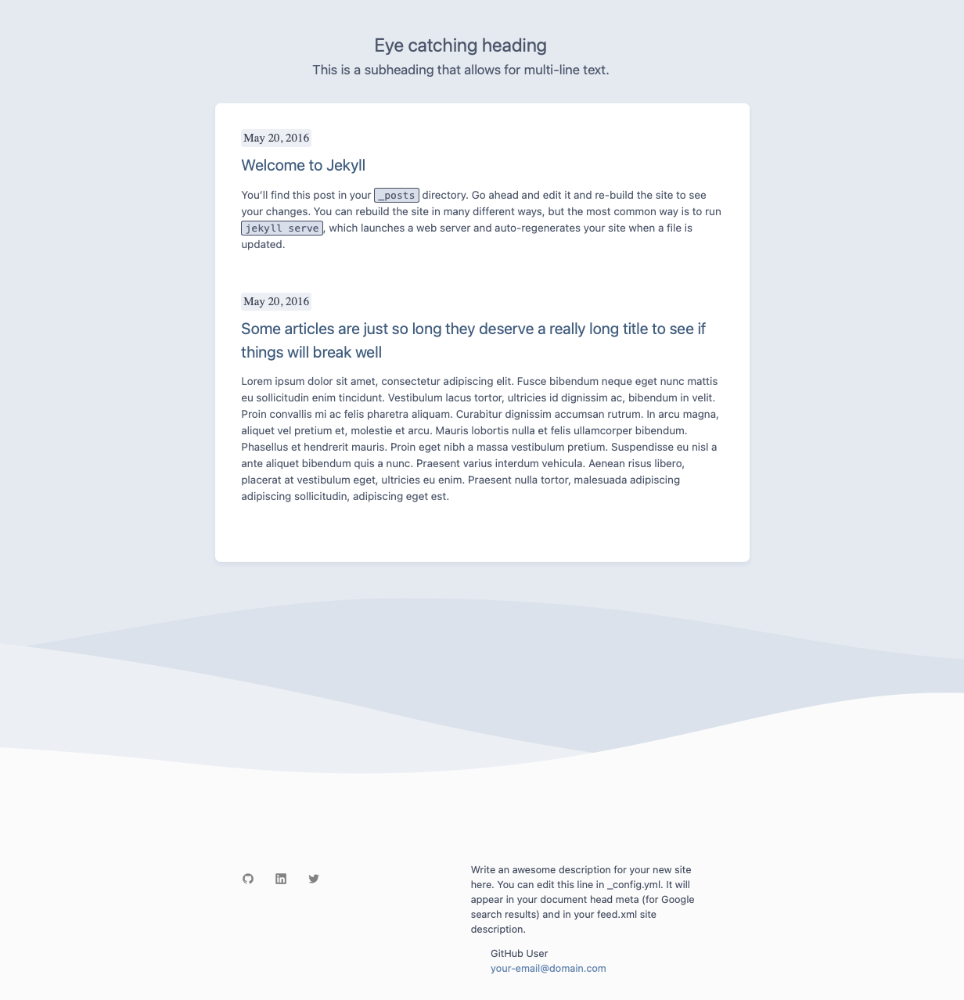

# jekyll-nord-theme

This is a theme for Jekyll based on [Nord](https://www.nordtheme.com).



## Installation

Add this line to your Jekyll site's `Gemfile`:

```ruby
gem "jekyll-nord-theme", git: 'https://github.com/mkrisher/jekyll-nord-theme'
```

And add this line to your Jekyll site's `_config.yml`:

```yaml
theme: jekyll-nord-theme
```

And then execute:

    $ bundle

Or install it yourself as:

    $ gem install jekyll-nord-theme

## Usage

All colors and styles are defined in the sass file. The layout is the default, inspired by the minima theme.

Create posts in your site's _posts directory.

Create top level naviation pages in the root directory. List them in the header_pages section of your _config.yml file.

## Contributing

Bug reports and pull requests are welcome on GitHub at https://github.com/mkrisher/jekyll-nord-theme. This project is intended to be a safe, welcoming space for collaboration, and contributors are expected to adhere to the [Contributor Covenant](http://contributor-covenant.org) code of conduct.

## Development

To set up your environment to develop this theme, run `bundle install`.

Your theme is setup just like a normal Jekyll site! To test your theme, run `bundle exec jekyll serve` and open your browser at `http://localhost:4000`. This starts a Jekyll server using your theme. Add pages, documents, data, etc. like normal to test your theme's contents. As you make modifications to your theme and to your content, your site will regenerate and you should see the changes in the browser after a refresh, just like normal.

When your theme is released, only the files in `_layouts`, `_includes`, `_sass` and `assets` tracked with Git will be bundled.
To add a custom directory to your theme-gem, please edit the regexp in `jekyll-nord-theme.gemspec` accordingly.

## License

The theme is available as open source under the terms of the [MIT License](https://opensource.org/licenses/MIT).

